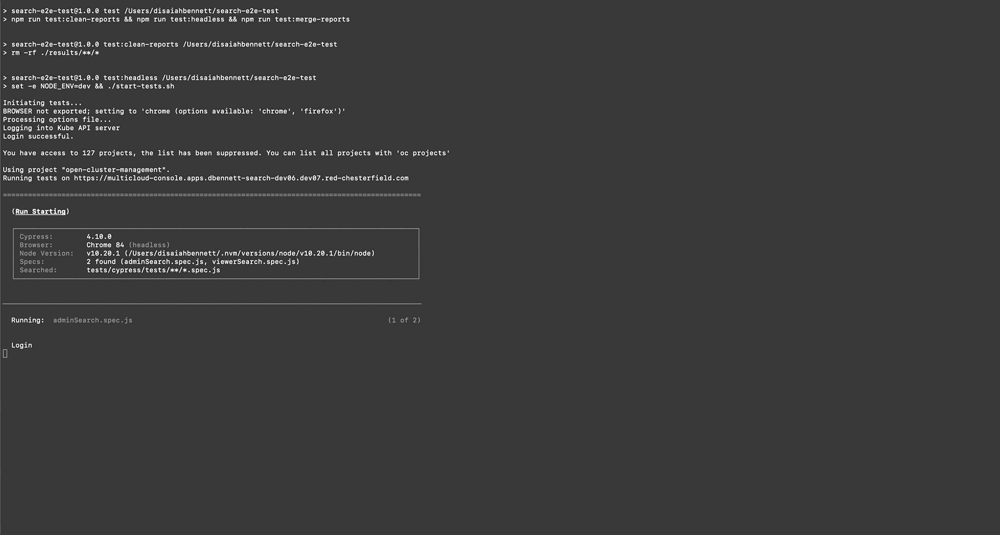

# search-e2e-test

End-to-end tests for the Open Cluster Management search component. The tests consist of the following user scenarios:

- [API tests](./tests/api/README.md)
- [UI tests](./tests/cypress/README.md)

## Running the tests locally

> Pre-requisites:
>
> - nodeJS
> - OpenShift CLI
> - yq command - [link](https://snapcraft.io/install/yq/fedora) for Fedora
> - a browser - either chrome or firefox

1. Copy the `options.yaml.template` file into `./options.yaml` and update with your target cluster access info.
2. Run `npm install`
3. Run `npm run test` OR `npm run test:headed`

## Running the tests using Docker image

1. Copy the `options.yaml.template` file into `./options.yaml` and fill in the necessary values.
2. Pull an existing image or build your own using `docker build -t <image_name>:<tag> .`
3. Run the image with the following command `docker run -it --volume $(pwd)/test-output:/results --volume $(pwd)/options.yaml:/resources/options.yaml <image_name>:<tag>`
   > **Alternative:** Pass the values in options.yaml as environment variables to the image like: `-e OPTIONS_HUB_BASEDOMAIN=${value}`

## NPM Commands

| Command                      | Description                                                                                    |
| ---------------------------- | ---------------------------------------------------------------------------------------------- |
| `npm run test`               | Run Cypress tests                                                                              |
| `npm run test:api`           | Run Search API tests (jest)                                                                    |
| `npm run test:clean-reports` | Remove reports within the results directory                                                    |
| `npm run test:debug`         | Remove reports within the results directory                                                    |
| `npm run test:headed`        | Run Cypress tests and display test being executed within the browser (Default browser: chrome) |
| `npm run test:headless`      | Run Cypress tests while hiding the browser                                                     |
| `npm run test:merge-json`    | Merge JSON report files within the results/json directory                                      |
| `npm run test:merge-reports` | Merge reports within the results directory                                                     |
| `npm run test:merge-xml`     | Merge XML report files within the results/xml directory                                        |
| `npm run test:production`    | Run Cypress tests in the production environment                                                |

## Export Variables

| Name                         | Optional/Required | Description                                                                                                                         |
| ---------------------------- | ----------------- | ----------------------------------------------------------------------------------------------------------------------------------- |
| BASE_URL                     | Optional          | Base URL that Cypress will use to run the tests (**Alt**: `CYPRESS_BASE_URL`, required if running in `npx cypress open`)            |
| BROWSER                      | Optional          | Browser that Cypress will use to run the tests (**Default**: 'chrome', **Options**: `chrome`, `firefox`)                            |
| CYPRESS_ACM_VERSION          | Optional          | ACM version that is being used for the test (**Default**: Version is determined by the deployed ACM version)                        |
| CYPRESS_TAGS_INCLUDE         | Optional          | Tags that will include a subset of tests when testing in Cypress (i.e `@CANARY+@BVT`)                                             |
| CYPRESS_TAGS_EXCLUDE         | Optional          | Tags that will exclude a subset of tests when testing in Cypress (i.e `@ROSA+-@RBAC`)                                             |
| NODE_ENV                     | Optional          | Node enviroment that the E2E test is being executed in (**Default**: development **Options**: `debug`, `development`, `production`) |
| OPTIONS_HUB_BASEDOMAIN       | Required          | Base domain for the hub cluster (**Alt**: `CYPRESS_OPTIONS_HUB_BASEDOMAIN`, required if running in `npx cypress open`)              |
| OPTIONS_HUB_KUBECONFIG       | Optional          | Kubeconfig that will be used for the hub cluster (**Default**: /opt/.kube/config) (**Alt**: `CYPRESS_OPTIONS_HUB_KUBECONFIG`, required if `hub-kubeconfig` is being used for E2E test or if running in `npx cypress open`) |
| OPTIONS_HUB_KUBECONTEXT      | Optional          | Kube context that will be used for the hub cluster (**Alt**: `CYPRESS_OPTIONS_HUB_KUBECONTEXT`, required if `hub-kubeconfig` is being used for E2E test or if running in `npx cypress open`) |
| OPTIONS_HUB_OC_IDP           | Optional          | Openshift user identify provider for the hub cluster (**Default**: kube:admin) (**Alt**: `CYPRESS_OPTIONS_HUB_OC_IDP`)              |
| OPTIONS_HUB_PASSWORD         | Required          | Password for the hub cluster (**Alt**: `CYPRESS_OPTIONS_HUB_PASSWORD`, required if running in `npx cypress open`)                   |
| OPTIONS_HUB_USER             | Required          | User for the hub cluster (**Alt**: `CYPRESS_OPTIONS_HUB_USER`, required if running in `npx cypress open`)                           |
| OPTIONS_MANAGED_BASEDOMAIN   | Optional          | Base domain for the managed cluster (**Alt**: `CYPRESS_OPTIONS_MANAGED_BASEDOMAIN`, required if testing the managed cluster without using the `import-kubeconfig` or if running in `npx cypress open`) |
| OPTIONS_MANAGED_CLUSTER_NAME | Optional          | Name of the managed cluster (**Alt**: `CYPRESS_OPTIONS_MANAGED_CLUSTER_NAME`, required if testing the managed cluster and if there are more than one managed clusters or if running in `npx cypress open`)|
| OPTIONS_MANAGED_KUBECONFIG   | Optional          | Kubeconfig that will be used for the managed cluster (**Default**: /opt/.kube/import-config) (**Alt**: `CYPRESS_OPTIONS_MANAGED_KUBECONFIG`, required if testing the managed cluster with using the `import-kubeconfig` or if running in `npx cypress open`) |
| OPTIONS_MANAGED_KUBECONTEXT  | Optional          | Kube context that will be used for the managed cluster. (**Alt**: `CYPRESS_OPTIONS_MANAGED_KUBECONTEXT`, required if testing the managed cluster with using the `import-kubeconfig` or if running in `npx cypress open`) |
| OPTIONS_MANAGED_PASSWORD     | Optional          | Password for the managed cluster (**Alt**: `CYPRESS_OPTIONS_MANAGED_PASSWORD`, required if testing the managed cluster without using the `import-kubeconfig` or if running in `npx cypress open`) |
| OPTIONS_MANAGED_USER         | Optional          | User for the managed cluster (**Alt**: `CYPRESS_OPTIONS_MANAGED_USER`, required if testing the managed cluster without using the `import-kubeconfig` or if running in `npx cypress open`) |
| RECORD                       | Optional          | Option to record the E2E test run within the Cypress dashboard                                                                      |
| RECORD_KEY                   | Optional          | Dashboard key that is used to record the Cypress test within the Cypress dashboard (Required if `RECORD` is exported)               |
| SKIP_API_TEST                | Optional          | Option to skip the API E2E test                                                                                                     |
| SKIP_MANAGED_CLUSTER_TEST    | Optional          | Option to skip managed cluster E2E test (**Alt**: `CYPRESS_SKIP_MANAGED_CLUSTER_TEST`)                                              |
| SKIP_UI_TEST                 | Optional          | Option to skip the UI/Cypress E2E test                                                                                              |
| TEST_ENV                     | Optional          | Test environment to run the E2E test  (**Options**: `canary`, `rosa`)                                                               |
| TEST_MODE                    | Optional          | Test mode to run the E2E test  (**Options**: `BVT`, `smoke`) (**Alt**: `CYPRESS_TEST_MODE`)                                         |
| USE_HUB_KUBECONFIG           | Optional          | Option to use `hub-kubeconfig` in E2E test (**Alt**: `CYRESS_USE_HUB_KUBECONFIG`)                                                   |
| USE_MANAGED_KUBECONFIG       | Optional          | Option to use `import-kubeconfig` in E2E test (**Alt**: `CYRESS_USE_MANAGED_KUBECONFIG`)                                            |

## Links

These are a few useful links that will help provide technical reference and best practices when developing for the platform.

- [Cypress Docs](https://docs.cypress.io/guides/overview/why-cypress.html)
- [NPM Docs](https://docs.npmjs.com)
